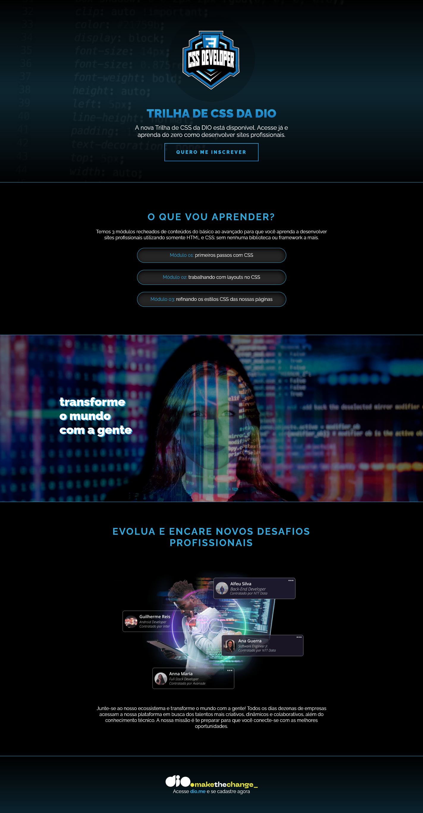

#  Landing Page | Desafio DIO

## 📃 Descrição

Desafio da *trilha de CSS* do bootcamp **NTT DATA Diversidade em Tech** da **Digital Innovation One (DIO)**.

Neste desafio, foi proposto desenvolver a parte do CSS de uma *Landing Page* sobre a *trilha de CSS da Dio*. Foi utilizado apenas o que foi aprendido durante a trilha de CSS, nos cursos:

* Fundamentos do CSS
* Estilizações Básicas com CSS
* Unidades de Medida

Não foi proposto, mas tomei a liberdade de **deixar o site responsivo**, utilizando os conceitos aprendidos até então no bootcamp, além de utilizar os conhecimentos que já possuo.

O site sem modificações no HTML, simplificado e sem a responsividade está na branch *old*.

## 🖼️ Imagem do site

## 📌 Mais informações

E
